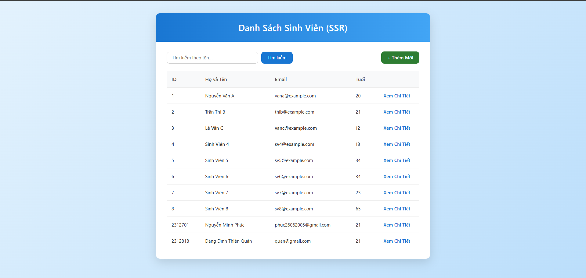
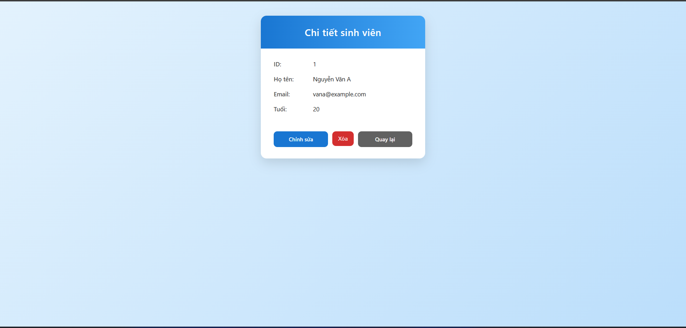
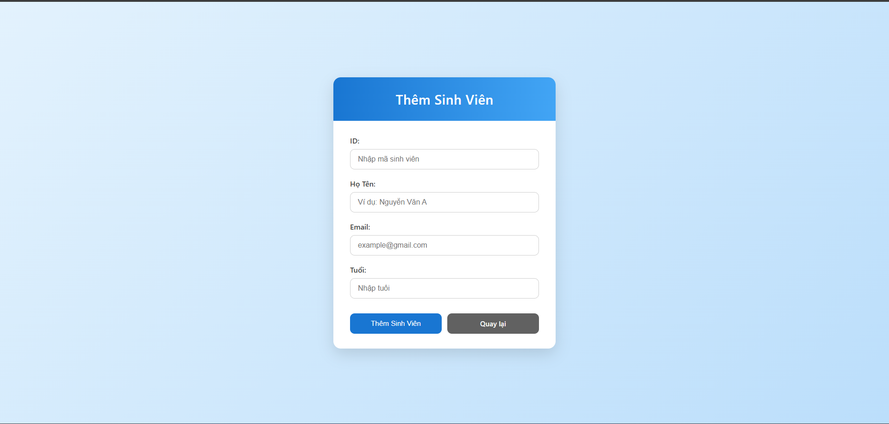
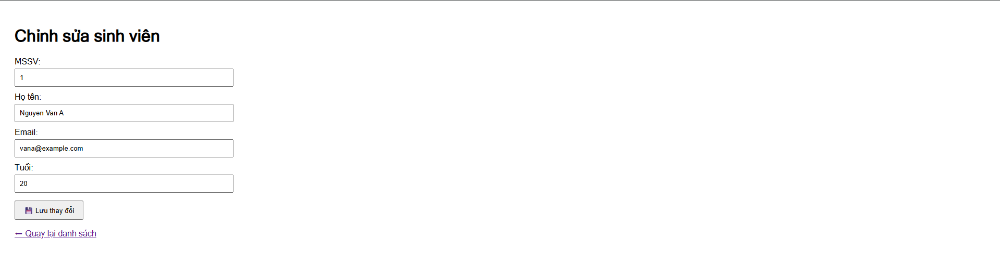

# Student Management System

Dự án quản lý sinh viên sử dụng Java Spring Boot, thực hiện theo kiến trúc Layered Architecture.

## 👥 Danh sách thành viên

- **Nguyễn Minh Phúc** - MSSV: 2312701 L01
- **Đặng Đình Thiên Quân** - MSSV: 2312818 L02

## 🌐 Public URL

- **Ứng dụng (Render):**
- **Database:** PostgreSQL (Neon.tech)

## 🛠 Hướng dẫn chạy dự án

### Chạy cục bộ (Local)

1. **Yêu cầu:** JDK 17+ và Maven.
2. **Cấu hình biến môi trường:** Tạo file .env hoặc chỉnh sửa trong src/main/resources/application.properties các thông tin kết nối Database.
3. **Lệnh thực thi:** Mở terminal tại thư mục gốc và chạy:

```bash
   ./mvnw spring-boot:run
```

4. **Truy cập:**

- Giao diện Web: http://localhost:8080/students
- API REST: http://localhost:8080/api/students

### Chạy bằng Docker:

1. **Build Image:**

```bash
   docker build -t docker-web-app:latest .
```

2. **Run Container:**

```bash
   docker run -p 8080:80 docker-web-app:latest
```

## 📖 Câu trả lời lý thuyết:

### Lab 1:

1. Ràng buộc Khóa Chính (Primary Key):

Sau khi thêm ràng buộc PK, Cố tình Insert một sinh viên có id trùng với một người đã có sẵn thì ta quan sát được thông báo lỗi: UNIQUE constraint failed. Database chặn thao tác này vì id đã được định nghĩa là PK (Khóa chính) với quy tắc của Khóa chính là: Duy nhất (Unique) và Không được trống (Not Null).

2. Toàn vẹn dữ liệu (Constraints):

Thử Insert một sinh viên nhưng bỏ trống cột name (để NULL), Database không báo lỗi và chấp nhận giá trị NULL. Từ đó có thể nhận ra, khi code Java đọc dữ liệu lên, sự thiếu chặt chẽ này ảnh hưởng:

- Lỗi NullPointerException (NPE): Nếu code Java lấy dữ liệu lên và thực hiện các thao tác như student.getName().toUpperCase() hoặc hiển thị lên giao diện mà không kiểm tra null, ứng dụng sẽ bị crash.
- Dữ liệu rác: Giao diện người dùng sẽ hiển thị các dòng trống hoặc chữ "null", gây mất chuyên nghiệp và khó khăn cho việc tìm kiếm/lọc sinh viên.
- Logic nghiệp vụ: Các hàm xử lý logic (ví dụ: kiểm tra tên hợp lệ) sẽ bị sai lệch.

3. Cấu hình Hibernate:

Mỗi lần tắt ứng dụng và chạy lại, dữ liệu cũ lại bị mất hết vì dòng cấu hình trong file src/main/resources/application.properties:
spring.jpa.hibernate.ddl-auto=create. Giá trị create ra lệnh cho Hibernate xóa toàn bộ các bảng cũ và tạo lại bảng mới từ đầu mỗi khi ứng dụng khởi chạy.

## 📸 Screenshot các module:

### Trang Danh sách



### Trang Chi tiết



### Chức năng Thêm mới



### Chức năng Chỉnh sửa


